# Blockchain Network Analysis on Liquity

# Resources

GitHub Repo: [https://github.com/SciEcon/BNS-LQTY](https://github.com/SciEcon/BNS-LQTY)

|  | Coinbase | Binance |
| --- | --- | --- |
| Liquity | January 12, 2022 | Not yet |
| AAVE | December 14, 2020 | October 16, 2020 |
| Compound | June 23, 2020 | June 25, 2020 |
| MakerDAO DAI | May 23, 2019 | July 23, 2020 |

# **LUSD stablecoin**

LUSD is the USD-pegged stablecoin used to pay out loans on the Liquity protocol. At any time it can be redeemed against the underlying collateral at face value [[1](https://docs.liquity.org/faq/general)].

**Genesis date:** 2021-04-15

### 1. Data

**The last date of the collected data**: 22-07-12

**Analysis time range**: 2021-04-15 - 2022-07-11

**Number of transaction records**: 211,683

**Number of unique addresses**: 50,334

**Total value:** 3.6510201741225817e+28 Wei

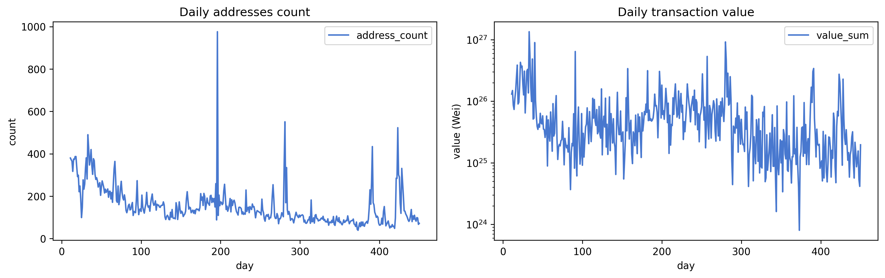

*Figure 1. Time series plot of daily number of addresses and transaction records*

---

### 2. Core-periphery test

**Significant days** VS **Insignificant days**: 349 (75.38%) | 114 (24.62%)

*Figure 2. Day counts of significant and insignificant core-periphery test*

---

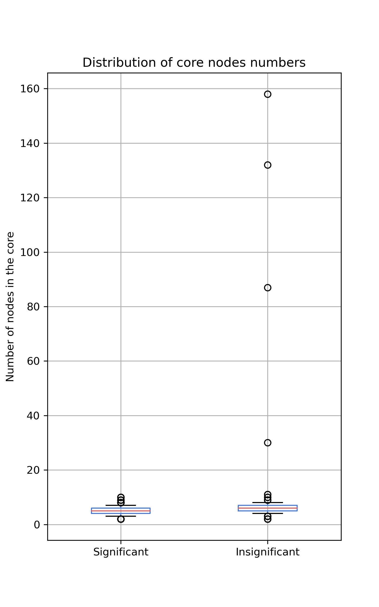

*Figure 3. Distribution of the number of core nodes*

---

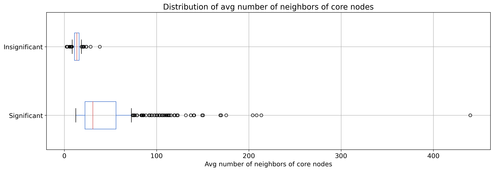

*Figure 4. Distribution of average number of neighbors of core nodes*

---

**CA VS EOA**: 112 (29.63%) | 266 (70.37%)

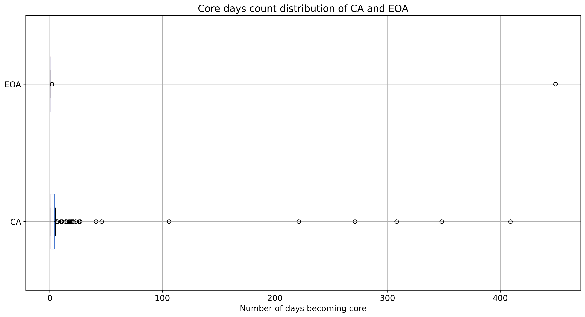

*Figure 5. Distribution of the number of core days for EOAs and CAs,*

---

### **3. Network dynamics**

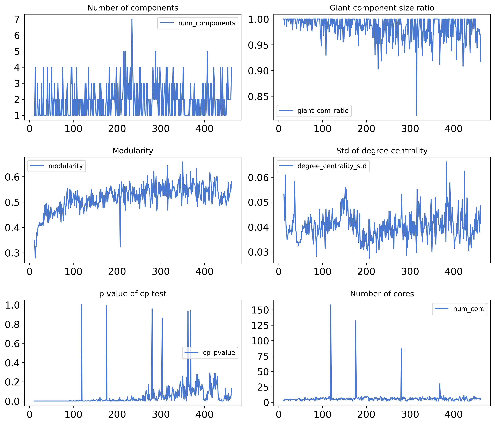

*Figure 6. Time-series plots of network features*

---

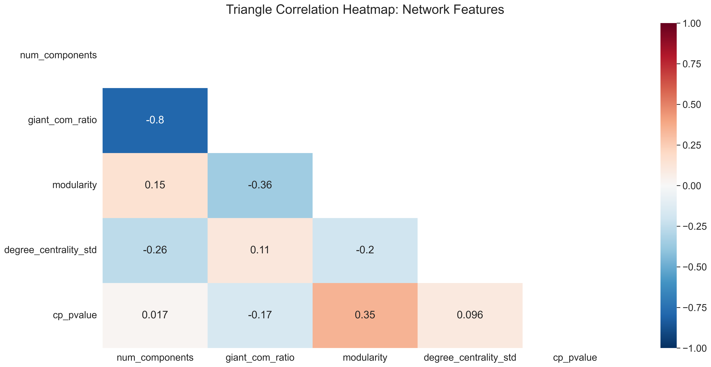

*Figure 7. Correlation heatmap of network features*

---

# **Liquity token (LQTY)**

LQTY is the secondary token issued by Liquity. It captures the fee revenue that is generated by the system and incentivizes early adopters and frontends. [[1](https://docs.liquity.org/faq/general)]

**Genesis date:** 2021-04-05

### 1. Data

**The last date of the collected data**: 22-07-12

**Analysis time range**: 2021-04-05 - 2022-07-11

**Number of transaction records**: 203,335

**Number of unique addresses**: 46,709

**Total value:** 5.14733209475775e+26 Wei

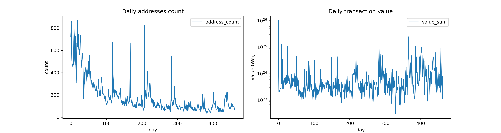

*Figure 1. Time series plot of daily number of addresses and transaction records*

---

### 2. Core-periphery test

**Significant days** VS **Insignificant days**: 348 (75.49%) | 113 (24.51%)

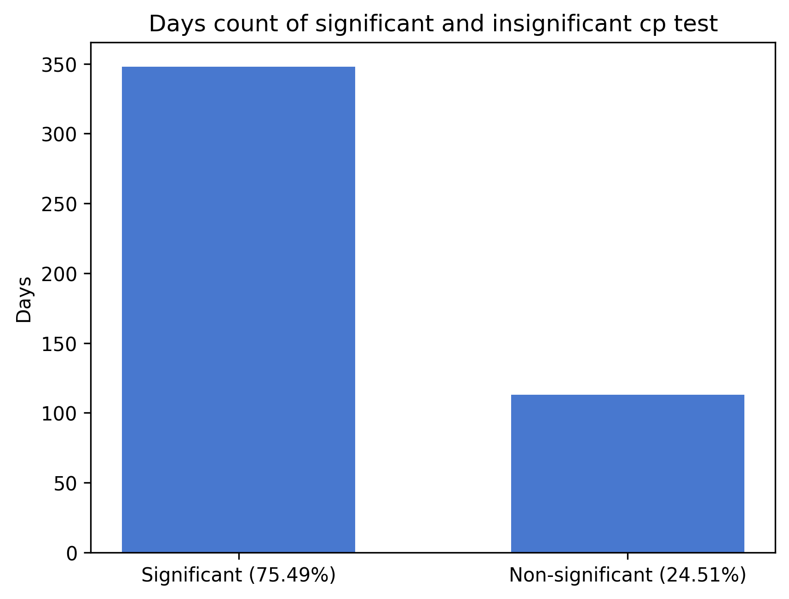

*Figure 2. Day counts of significant and insignificant core-periphery test*

---

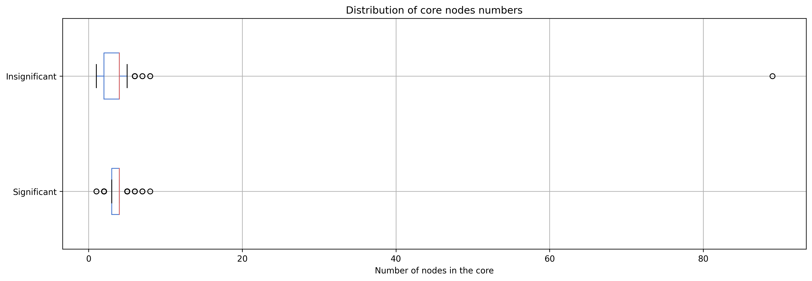

*Figure 3. Distribution of the number of core nodes*

---

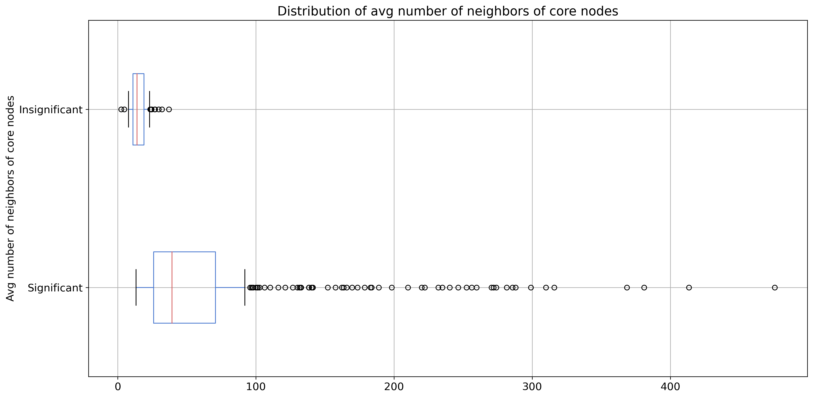

*Figure 4. Distribution of average number of neighbors of core nodes*

---

**CA VS EOA**: 45 (39.13%) | 70 (60.87%)

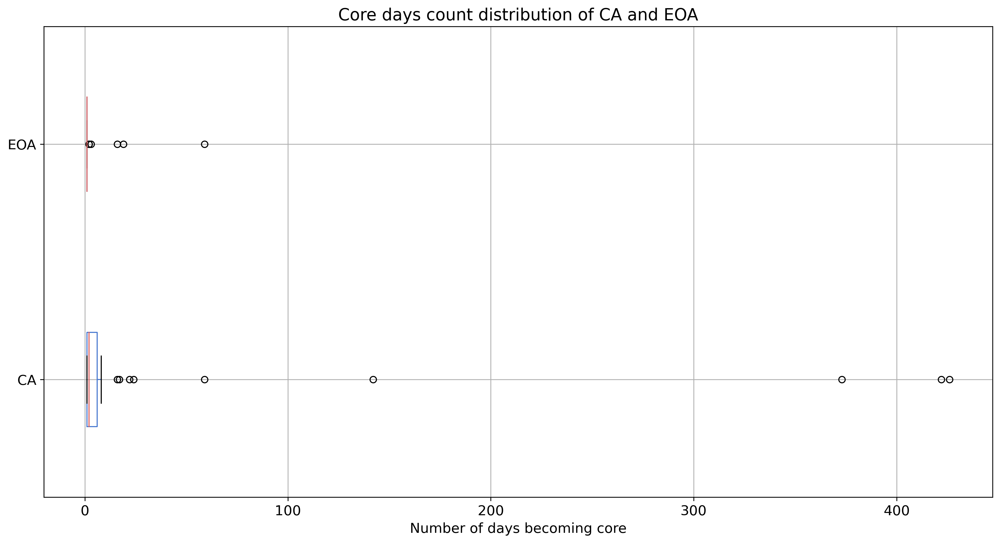

*Figure 5. Distribution of the number of core days for EOAs and CAs,*

---

### **3. Network dynamics**

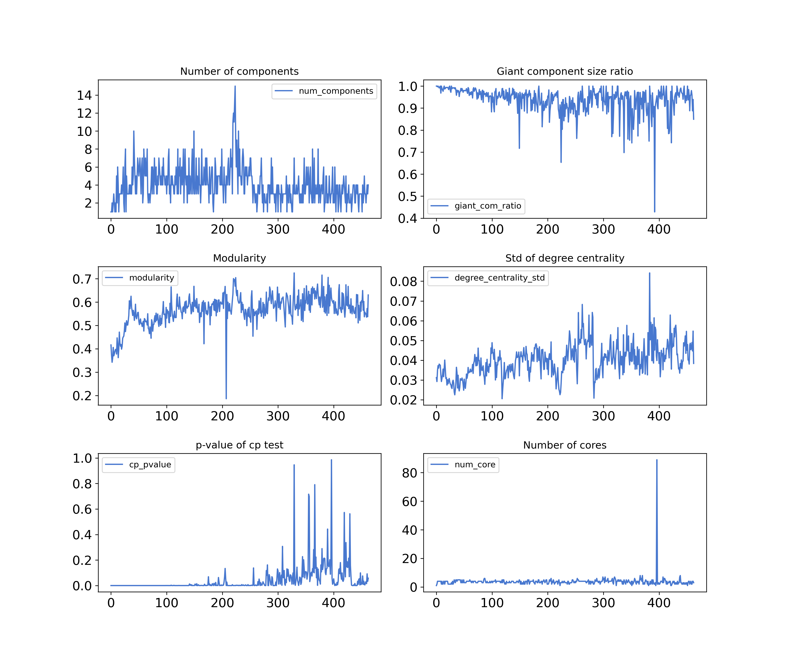

*Figure 6. Time-series plots of network features*

---

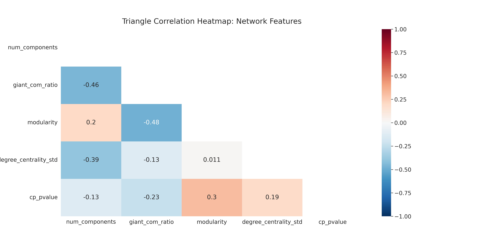

*Figure 7. Correlation heatmap of network features*

---